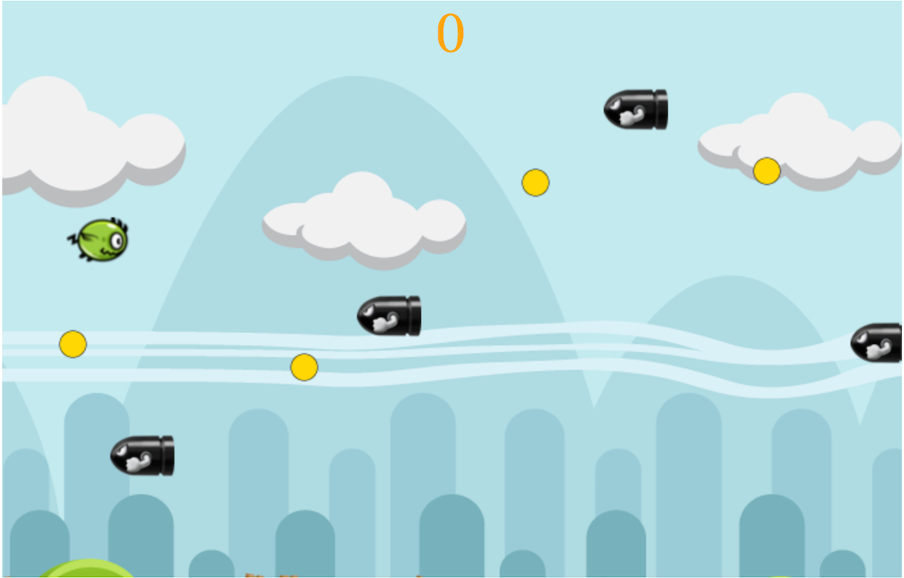

## Dodgey Bird

[Live Link](https://hellojohnito.github.io/Dodgey-Bird/)

<p align="center">
    
</p>

### Background

Dodgey Bird is a JavaScript game inspired by the original **Flappy Bird**. Dodgey Bird is an one player game where the player controls the vertical movement of the bird with the space key. The objective of the game is to dodge missiles while collecting coins. The player loses when he or she gets hit by the missile or flies too low.


### Technical Implementation

The game logic for Dodgey Bird is written in JavaScript with a hint of jQuery to show/hide the start and the retry menu. Dodgey Bird implements the HTML Canvas to render and update the game onto display.


#### Collision Calculation

The following code compares the radiuses of the two objects to calculate the distance between them. The moving objects collide when the distance between the two radiuses reaches zero or below. If the bird collides with a coin, the coin count increments by one but if the bird collides with an oncoming missile, the game will end.

```
// if the distance between the two object is less than the radius of the two object, they have collided with each other.  

isCollidedWith(otherObject) {
  let pos = [this.x, this.y];
  let otherObjectPos = [otherObject.x, otherObject.y];

  // calculates the distance between the two moving objects.
  const objectDist = this.distance(pos, otherObjectPos);

  return objectDist < (this.radius + otherObject.radius);
}

distance(pos1, pos2){
  let sum = Math.pow((pos2[0] - pos1[0]), 2) + Math.pow((pos2[1] - pos1[1]), 2);
  return Math.sqrt(sum);
}

```
