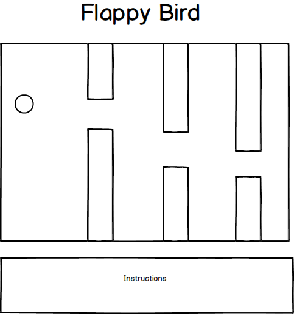

## Dodgey Bird

### Background

Dodgey Bird is a JavaScript game inspired by the original **Flappy Bird**. Dodgey Bird is an one player game where the player controls the vertical movement of the bird with the space key. The objective of the game is to dodge all the enemy birds that are headed to you. The player loses when he or she gets hits by the enemy birds.

### Functionality & MVP  

With this Flappy Bird simulator, users will be able to:

- [ ] Start game and reset the game  
- [ ] Control the bird's vertical motion by tapping on the spacebar
- [ ] The enemy will attack at random.

In addition, this project will include:

- [ ] An instruction
- [ ] A production Readme

### Wireframes

This app will consist of a single screen with the game displayed in the center. The instructions will be listed below the screen.

  

### Architecture and Technologies

This project will be implemented with the following technologies:

- Vanilla JavaScript and `jquery` for the overall structure
- `HTML5 Canvas` for DOM manipulation and rendering,
- Webpack to bundle and serve up the various scripts.

In addition to the webpack entry file, there will be four scripts involved in this project:

`bird.js`: this script will handle the logic for controlling the bird.

`pipes.js`: this script will handle creating the pipes.

`game.js`: this script will handle the game logic.

`game_view.js`: this script will handle displaying the game onto the screen.

### Implementation Timeline

**Day 1**: Setup all necessary Node modules, including getting webpack up and running. Create `webpack.config.js` as well as `package.json`.

Start creating the Bird logic for the bird and learn how to render the bird onto the screen with sprite images.
  - Bird methods: draw, fly, collideWith(Pipes), isCollidedWith(Pipes)
  - Pipes method: create and remove

**Day 2**: Create the game and the game view logic.
  - Game Methods: Holds all pipes and a bird, draws all objects, moves all objects,
      check for collision, adds pipes and removes objects off the screen.
  - Game View Methods: bind key handlers and start

**Day 3**: Continue with the Game Logic.

**Day 4**: Display with sprite images.
  - Learn how to display images onto the screen using sprite images.

### Bonus features
